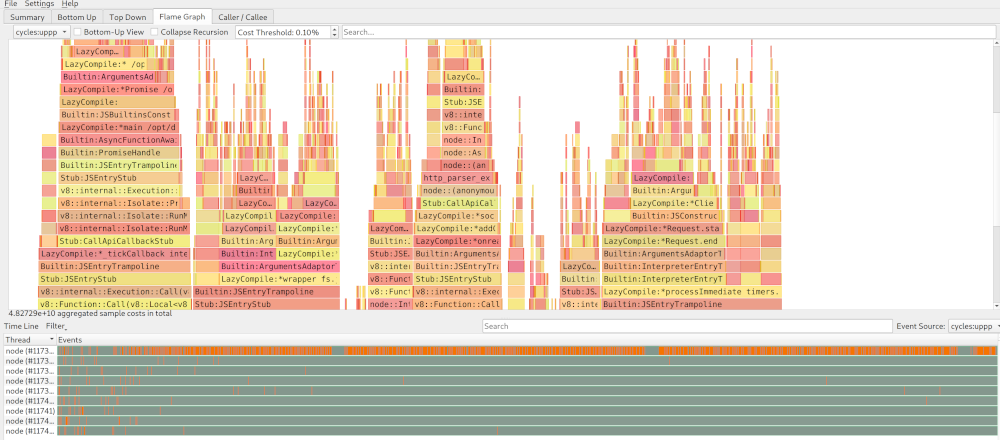
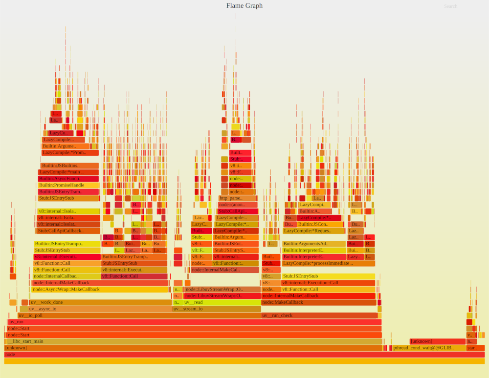

## Flamegraphs using linux perf events

Run your Node.js program with:

```
node --perf-basic-prof
```

```
perf record -F 99 -p `pgrep -n node` -g -- sleep 15
```

This will generate profile `perf.data` in folder where `perf` script was running.

### KDAB hotspot flamegraphs
Now you can open this directly in [KDAB hotspot](https://github.com/KDAB/hotspot).

If you run hotspot from the same directory where `perf.data` is located it will be automatically
opened and rendered. Otherwise you can load the file with `File > Open` and then selecting your
`perf.data` file.

Now you can inspect your profile in more details.



### SVG flamegraphs
If you do not want or you are not able to use Hotspot you can generate svg/html files as mentioned
on [brendangregg.org blog](www.brendangregg.com/blog/2014-09-17/node-flame-graphs-on-linux.html):

```
# cd to where your perf.data is
perf script > out.nodestacks01
git clone --depth 1 http://github.com/brendangregg/FlameGraph && cd FlameGraph
./stackcollapse-perf.pl < ../out.nodestacks01 | ./flamegraph.pl > ../out.nodestacks01.svg
# now open ../out.nodestacks01.svg in a browser
```


