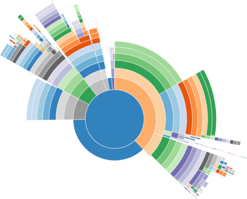

## V8 Profiler Sunburst

Here one can find example usage on using
[v8-profiler](https://github.com/node-inspector/v8-profiler) module for Node.js and generating
sunburst charts.

### Quickstart

Install `v8-profiler`:

```npm install v8-profiler```

Include `profilev8.js` as part of your program:
```
require('./v8-profile.js')()
```

Now run your program.

This will start profiling and do `process.exit` when it is done. By default it runs after 5 seconds
and stops after 15 seconds. Profile file will be written to the same place your main script is being
located (`__dirname`).

### Example

`index.js`
```
const http = require('http')

const server = http.createServer((req, res) => {
  res.end('hello\n')
})

server.listen(3000, 'localhost', () => {
  console.log('Server running')
})

require('./v8-profile.js')()
```

Now run it as:

```
PROFILE_TIMEOUT=60000 node index.js
```

After 60 seconds you can find a json profile file in the same directory like
`1528548297831.profile`.

Now you can use an http server to serve the `profile.html` or open it directly depending on how your
browser is configured:

To open locally enter this as url:
```
file:///path/to/file/profile.html?1528534695870.profile
```
Profile file has to be at the same location where `profile.html` is.

If using `http-server`:
```
npm install -g http-server
http-server -p 3333 .
```

Then you can find it at `http://localhost:3333/profile.html?1528534695870.profile`.



You can hover over elements and click on them to zoom in/out and get more details.
